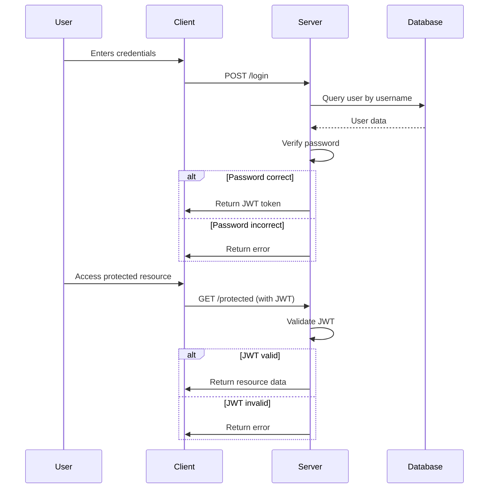

# Role-Based Login Mechanism
A secure and scalable role-based login system using Flask, designed to authenticate users and manage access based on roles.


## Overview
The Role-Based Login Mechanism project is a simple yet robust authentication system built using Flask. It provides a foundation for implementing user authentication with role-based access control, allowing different permissions for users and admins. This project is ideal for developers looking to integrate a secure login system into their applications.

## Architecture & Workflow

The system architecture is centered around a Flask application that interacts with a SQLite database to store user credentials and roles. The application uses JWT (JSON Web Tokens) for secure authentication sessions.



## Granular Tech Stack
- **Languages**: Python
- **Frameworks**: Flask
- **Libraries**:
  - Flask-SQLAlchemy: ORM for database interactions
  - Flask-JWT-Extended: Handling JWT authentication
  - Werkzeug: Password hashing utilities
- **Database**: SQLite

## Key Features
- User registration with role assignment
- Secure login with password hashing
- JWT-based authentication
- Role-based access control
- Extensible for additional roles and permissions

## Project Structure
```
role-based-login-mechanism/
├── README.md
├── app.py
├── login.html
├── register.html
└── users.db
```

## Getting Started

### Prerequisites
- Python 3.x
- pip (Python package manager)

### Installation
1. **Clone the repository**:
   ```bash
   git clone https://github.com/yourusername/role-based-login-mechanism.git
   cd role-based-login-mechanism
   ```

2. **Install dependencies**:
   ```bash
   pip install -r requirements.txt
   ```

3. **Set up the database**:
   ```bash
   python
   >>> from app import db
   >>> db.create_all()
   >>> exit()
   ```

### Running the Project
```bash
python app.py
```

## Usage
- **Register a new user**: Send a POST request to `/register` with `username`, `password`, and `role`.
- **Login**: Send a POST request to `/login` with `username` and `password` to receive a JWT token.
- **Access protected resources**: Send requests with the JWT token in the `Authorization` header.

## Roadmap
- Implement password reset functionality
- Add email verification during registration
- Integrate OAuth for third-party logins
- Develop a frontend interface with React or Angular

## Contributing
Contributions are welcome! Please fork the repository and submit a pull request for review.

## License
This project is licensed under the MIT License. See the [LICENSE](LICENSE) file for details.
